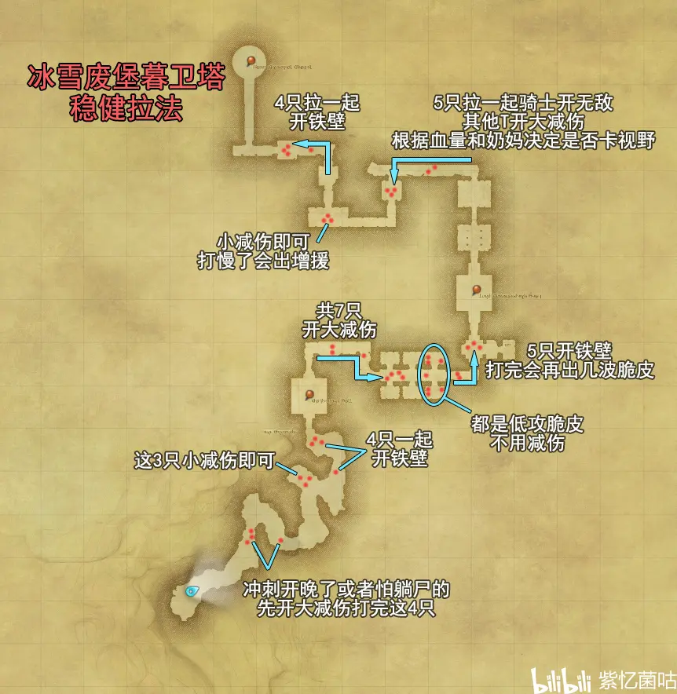
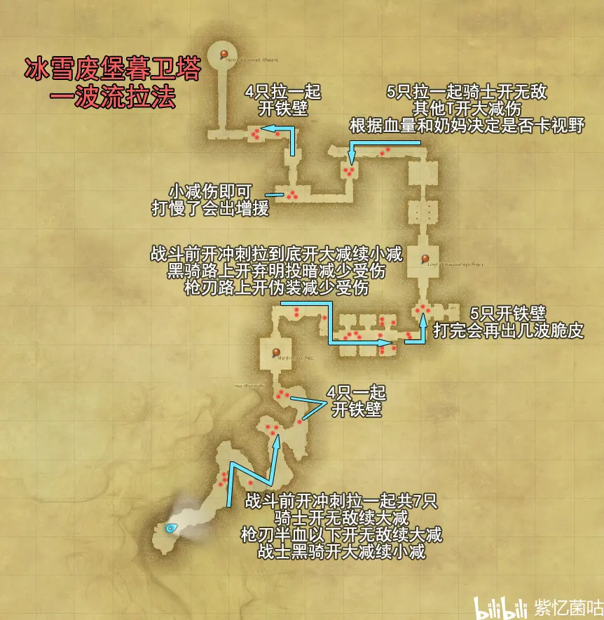

<!-- docs/duty_4/冰雪废堡暮卫塔.md -->

# 51级 冰雪废堡暮卫塔

> https://www.bilibili.com/read/cv10514557

小怪打人很疼的一个本，怪物分布也不太友好，导致T很难在这个本权衡好拉怪数量和减伤分配，不熟的话建议少拉，不然很容易死。

老一的冲撞是分摊技能

老二拉离刚复活的小怪

老二后面那一波房间里的3个冰元精有两种卡视野的方式，可参考当期视频

## 稳健

## 一波

