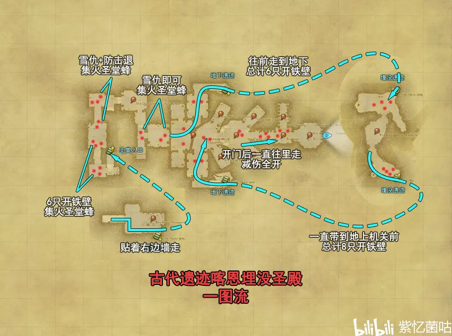

<!-- docs/duty_4/古代遗迹喀恩埋没圣殿.md -->

# 35级 古代遗迹喀恩埋没圣殿

> https://www.bilibili.com/read/cv10452591

首个出现机制杀的副本，初见T在这里面还是有蛮多要注意的地方的（现在来看这图其实做得挺乱的_(:з」∠)_）

集火圣堂蜂并注意打断它读条的终极针

自己距离机关2个身位能正好让石面像踩在机关上

在地下老二前后的两波小怪可以切步行模式避开战斗

## 一波

