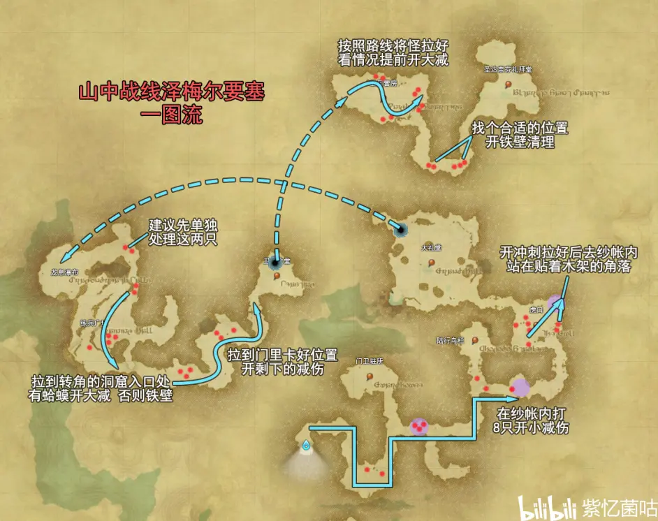

<!-- docs/duty_4/山中战线泽梅尔要塞.md -->

# 44级 山中战线泽梅尔要塞

> https://www.bilibili.com/read/cv10452591

拉怪难度比较大的一个本，所以说把这种本放在新手时期真的合适嘛。。。。T需要注意以下几点

老一前那一波可以卡在木架角落来聚怪

如果不熟，悬崖那段路建议分成3批清理，因为若同时引到2只蛤蟆大概率会团灭

洞穴里有很多可以卡视野的地方，但奶妈不太熟练的话最好别用

## 一波

